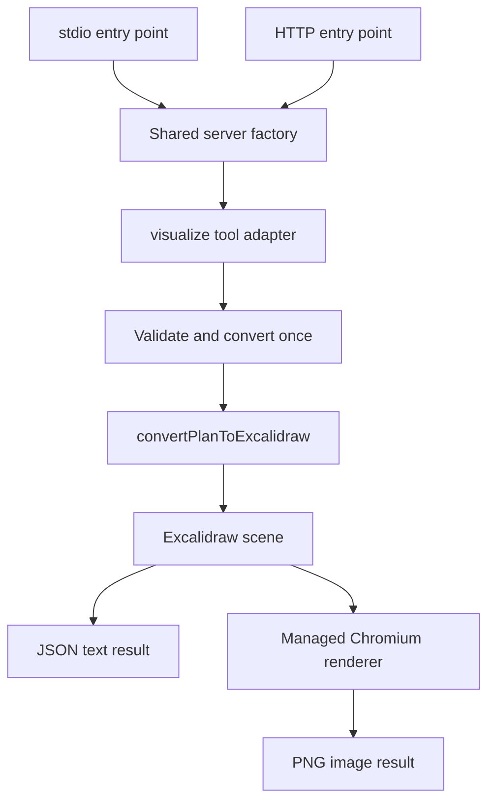

# Plan-viz MCP implementation plan

Status: implemented and locally verified. See [verification.md](./verification.md) for actual results and host/UI verification limits.

Use [plan.md](./plan.md) as a product reference. Its original checked checklist was not evidence of completed work: at planning time, the workspace contained the reference and Codex configuration only. This document organizes implementation into verifiable milestones.

## Outcome and scope

Build a local MCP server exposing one tool, `visualize`, that turns DataFusion physical plan text into editable Excalidraw JSON or a PNG. Support raw indented plans and DataFusion EXPLAIN / EXPLAIN ANALYZE table output. Return results through MCP without saving user plans or generated artifacts to disk.

Deliver stdio first, then Streamable HTTP at `http://127.0.0.1:3333/mcp`. Both transports use the same tool registration and conversion service. HTTP remains local-only for this release.

Exclude SQL execution, database connections, plan optimization advice, other database dialects, extra tools/resources/prompts, custom generators, a web application, and public hosting. Publishing the npm package is a separate release action; preparing and testing a distributable package is in scope.

## Technical decisions

- Use TypeScript in strict ESM mode, including `noUncheckedIndexedAccess`, with npm and a committed lockfile. Target Node.js 24 initially; verify dependency engine requirements before finalizing the supported runtime. The reference's Node.js 20 baseline should not be carried forward automatically; check the [Node.js release schedule](https://nodejs.org/en/about/previous-releases).
- Use the official MCP TypeScript SDK v2 server and Node HTTP adapter, plus Zod v4. The [SDK repository](https://github.com/modelcontextprotocol/typescript-sdk) identifies v2 as the stable line for the [2026-07-28 specification](https://modelcontextprotocol.io/specification/2026-07-28). Pin a tested package combination during the first milestone; do not copy transport imports from the reference without compiling them.
- Let the SDK implement discovery, protocol metadata, result envelopes, and transport behavior. Verify compatibility with an actual intended host before committing to the transport implementation. Do not hand-build JSON-RPC or silently add legacy protocol support.
- Import only `convertPlanToExcalidraw` from `plan-viz`. Its [public API](https://github.com/NGA-TRAN/plan_viz#api) provides the scene used by both output formats. Confirm the installed release's behavior using representative fixtures.
- Render PNG using Playwright Chromium and Excalidraw's official [`exportToBlob`](https://docs.excalidraw.com/docs/@excalidraw/excalidraw/api/utils/export#exporttoblob). Bundle the renderer and required fonts locally so rendering needs no CDN or hosted UI.
- Use Vitest for unit/integration tests, ESLint, and Prettier. Keep browser tests separate from the fast default suite, but require them for release acceptance.

## Tool contract

```ts
type VisualizeInput = {
  plan: string;
  format: '.excalidraw' | '.png';
};
```

Both fields are required. Reject whitespace-only plans and plans exceeding 512 KiB measured as UTF-8 bytes. Preserve the original indentation; checking whether a plan is blank must not trim the string passed to the converter. Do not introduce a second plan parser.

| Request | Content | Structured metadata |
| --- | --- | --- |
| `.excalidraw` | Pretty-printed scene JSON in a text block | `{ format: '.excalidraw', mimeType: 'application/json' }` |
| `.png` | Base64 PNG in an MCP image block | `{ format: '.png', mimeType: 'image/png' }` |
| Tool failure | Safe, actionable text and `isError: true`; no image or partial scene | Omit success metadata |

Successful scenes must contain a nonempty `elements` array. Define the input schema once and an output schema that couples each format with its correct MIME type. Follow the SDK's requirements for representing structured metadata in content; test the actual result rather than assuming the reference's exact block count is portable.

Use `readOnlyHint: true`, `destructiveHint: false`, `idempotentHint: true`, and `openWorldHint: false`. Idempotence describes the absence of repeated side effects, not byte-identical scene IDs or PNGs.

Keep tool failures distinct from malformed protocol requests. Invalid tool arguments and conversion/render failures should follow the SDK's tool-error behavior; malformed envelopes, unknown methods, and transport rejection retain their protocol/HTTP errors. Confirm this at the client boundary against the [MCP tools specification](https://modelcontextprotocol.io/specification/2026-07-28/server/tools). Do not rewrite every failure into a successful JSON-RPC response.

## Architecture



Transport entry points own startup and shutdown. The server factory registers the tool. A transport-independent service accepts injectable converter and renderer dependencies and returns typed results; the tool adapter maps these into MCP content and safe errors. There is one validation/conversion path, with no duplicated logic in transport handlers.

Start Chromium lazily for the first PNG request. Reuse one browser per process with an isolated context/page per job, closed in `finally`. Serialize rendering initially and bound the waiting queue. Handle launch failure, timeout, browser crash, cancellation, and process shutdown. `.excalidraw` must remain usable when Chromium is absent or unavailable.

Bundle a small browser entry point and fonts into the package. Load these through Playwright-controlled in-memory routes; pass scene data as structured values, never interpolated HTML or JavaScript. Block external network requests. Browser temporary profiles are runtime infrastructure; do not persist plans or result files.

Proposed starting limits, to validate during implementation: 512 KiB plan input, 4 MiB HTTP request body to accommodate JSON escaping, 30 seconds per render including queue wait, one active render with four waiting jobs, 16 megapixels per image, and an 8 MiB serialized tool-result limit. Enforce bounds before expensive allocation where possible, count base64 expansion, and return a useful size error without silently truncating the diagram. These are project defaults, not MCP protocol limits.

## Milestones

### 1. Establish compatibility and prove the rendering path

- Scaffold package metadata, TypeScript/build configuration, linting, and tests. Resolve and lock compatible SDK, `plan-viz`, Excalidraw, Playwright, and schema-library versions.
- Establish the shared sample from the reference and short EXPLAIN / EXPLAIN ANALYZE fixtures. Preserve significant whitespace in fixture files.
- Convert the sample using the real public library API and confirm the result opens as an Excalidraw scene.
- Prove one real PNG export with bundled assets, fonts loaded, and external network blocked. Inspect labels, arrows, and clipping.
- Exercise a minimal SDK server using its client and an available intended host. Record host/version/protocol compatibility and verify that the host displays MCP image content.

Exit: the conversion, browser export, and MCP host connection are demonstrated. Record exact imports, dependencies, and any compatibility limitation before expanding the server. If the intended host cannot use v2, resolve that explicitly before implementing a fallback.

### 2. Deliver JSON visualization over stdio

- Implement shared schemas, constants, conversion service, safe errors, and `createServer` with exactly one registered tool.
- Reject invalid inputs before conversion and reject empty/unusable converter output. Call the converter once per valid request.
- Add the executable stdio entry point with all diagnostic logging on stderr. Avoid logging plan contents by default.
- Test real conversion for raw/table fixtures, UTF-8 boundaries, indentation preservation, missing/unknown format, converter failures, and output metadata.
- Test through an SDK client and a spawned stdio process, including tool discovery and absence of stdout contamination.

Exit: a client can discover `visualize` and obtain valid `.excalidraw` output from the built executable. Errors are actionable and contain no stack traces or echoed plan data.

### 3. Complete PNG support and browser lifecycle

- Promote the rendering proof into the managed renderer described above; keep its interface injectable for service tests.
- Add bounded jobs, deadlines, cleanup, browser restart after failure, and graceful shutdown. A timed-out render must close its context rather than keep working in the background.
- Handle missing Chromium with installation guidance. Resolve assets relative to the installed package, independent of the caller's working directory.
- Cover renderer failure paths using fakes, then run real-browser tests for PNG decoding, nonzero dimensions, visible output, fonts, and long/wide diagrams. Checking only PNG magic bytes is insufficient.
- Measure conversion time for large accepted inputs. If synchronous conversion blocks requests or prevents cancellation for unacceptable periods, isolate conversion in a terminable worker; do not claim a promise timeout can interrupt synchronous code.

Exit: both formats work, JSON requests do not launch Chromium, browser failures do not disable JSON output, and completed/failed jobs leave no open contexts.

### 4. Add local Streamable HTTP

- Wire the same server factory through the SDK Node adapter at `/mcp`, binding `127.0.0.1` by default.
- Apply exact Host/Origin allowlists, with absent Origin accepted for native MCP clients. Bound request bodies and reject disallowed origins before conversion.
- Use the SDK's request lifecycle and share the bounded renderer manager across requests. Keep scene state isolated between jobs.
- Add HTTP integration tests for discovery, both formats, tool errors, malformed requests, unsupported methods, oversized bodies, header guards, concurrent requests, and shutdown.

Exit: stdio and HTTP pass the same tool-contract tests; HTTP is reachable locally and has no accidental public bind or permissive cross-origin access.

### 5. Package, document, and verify the release candidate

- Provide `build`, `typecheck`, `lint`, `format:check`, `test`, `test:png`, `start`, and `start:http` scripts, and the `plan-viz-mcp` executable mapping.
- Document installation, the tested Node version, Chromium installation, both transports, local-from-source host configuration, all four reference examples, limits, and troubleshooting.
- Keep README examples consistent with shared fixtures and real tested responses. Label abbreviated request examples as SDK call arguments rather than complete protocol messages.
- Document `npx plan-viz-mcp` as available only after publication; make the local installation path usable immediately.
- Use separate CI jobs for fast tests and real Chromium integration. The browser job must fail if its browser is missing; it must not silently skip release verification.
- Test `npm pack` output installed into a clean temporary project, run it outside the source directory, and verify packaged browser assets, executable entry points, and both formats. Inspect the package file list for unintended files.

Exit: all checks pass from a clean install and the packed package works through both transports. Record actual results in a release checklist before checking items off.

## Suggested file layout

```text
src/
  create-server.ts
  stdio.ts
  http.ts
  tools/visualize.ts       # Schema and MCP result adapter
  lib/constants.ts
  lib/visualize.ts         # Validation, conversion, format dispatch
  lib/errors.ts
  render/renderer.ts      # Browser lifecycle and bounded jobs
  render/browser.ts       # Bundled Excalidraw export entry
tests/
  fixtures/
  visualize.test.ts
  mcp.test.ts
  stdio.test.ts
  http.test.ts
  png.integration.test.ts
scripts/
  build-renderer.mjs
README.md
package.json
package-lock.json
tsconfig.json
```

Keep this layout small; introduce extra modules only when they own distinct behavior. Unit tests should validate observable behavior rather than duplicate implementation details.

## Completion checklist

- [x] Exactly one tool accepts the documented inputs through both transports.
- [x] Raw, EXPLAIN, and EXPLAIN ANALYZE fixtures produce valid scenes.
- [x] PNGs are rendered from those scenes and visually usable.
- [x] Invalid input and resource-limit failures return appropriate safe errors.
- [x] Browser resources are bounded and cleaned up on errors and shutdown.
- [x] Rendering works without external network access and without persisting plans/results.
- [x] Type checking, linting, formatting, fast tests, and real-browser tests pass.
- [x] The installed package works outside the repository with documented host configuration.
- [ ] Interactive intended-host verification: Inspector CLI discovery and both tool calls pass; Cursor/Codex desktop image presentation remains untested.
- [x] README instructions and examples match observed behavior.

The key changes from the reference are the early compatibility/rendering milestone, explicit browser asset packaging and resource limits, a required browser release check, and a real installed-package test. The intended tool scope and output formats remain the same.
