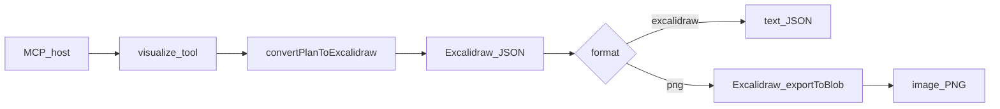

# Plan-viz MCP (single `visualize` tool)

## What the official MCP docs say (2026-07-28)

Current official sources:

- Spec: [https://modelcontextprotocol.io/specification/2026-07-28](https://modelcontextprotocol.io/specification/2026-07-28)
- Docs index: [https://modelcontextprotocol.io/llms.txt](https://modelcontextprotocol.io/llms.txt)
- TypeScript SDK v2: [`@modelcontextprotocol/server`](https://github.com/modelcontextprotocol/typescript-sdk) ([v2 docs](https://ts.sdk.modelcontextprotocol.io/v2/))

This revision is **stateless**. There is no `initialize` handshake and no `Mcp-Session-Id`. Every request carries protocol version and capabilities in `_meta`. Servers advertise themselves with `server/discover`. HTTP uses **Streamable HTTP** (POST-only MCP endpoint). HTTP+SSE is deprecated.

Use **tools** only for v1 (`tools/list`, `tools/call`). Zod/JSON Schema for inputs, optional `outputSchema`, and annotations (`readOnlyHint`, `idempotentHint`, `openWorldHint`). MCP tool results can return `text` or `image` content (`type: "image"`, base64, `mimeType: "image/png"`).

Do **not** add Roots, Sampling, or Logging (deprecated). For HTTP, validate `Origin`/`Host`, bind localhost unless intentionally public, and keep the handler per-request.

SDK shape (v2, not the old `@modelcontextprotocol/sdk`):

```ts
import { McpServer, createMcpHandler } from '@modelcontextprotocol/server';
import { serveStdio } from '@modelcontextprotocol/server/stdio';

function createServer(): McpServer { /* register visualize */ }
serveStdio(createServer);
const handler = createMcpHandler(createServer);
```

## What plan_viz actually is

[NGA-TRAN/plan_viz](https://github.com/NGA-TRAN/plan_viz) is a TypeScript library (`plan-viz` **0.1.22** on npm). There is **no hosted public HTTP API**. The companion UI [plan-visualizer](https://nga-tran.github.io/plan-visualizer/) is a client-side GitHub Pages app.

The **only public API this MCP will call**:

```ts
convertPlanToExcalidraw(plan: string, config?: ConverterConfig): ExcalidrawData
```

It accepts raw indented physical plans or SQL `EXPLAIN` / `EXPLAIN ANALYZE` text (`physical_plan` / `Plan with Metrics` rows) and returns Excalidraw JSON. It does **not** emit PNG.

Do not import or call `ExecutionPlanParser`, `ConverterService`, or custom generators. Do not add parse/summarize/analyze tools.



## Production quality and DRY

Treat this as production code, not a demo stub.

- **One factory:** `createServer()` is the only place that registers tools. `stdio.ts` and `http.ts` only choose a transport.
- **One visualize path:** `src/lib/visualize.ts` owns validation, the plan-viz call, and format dispatch. Tool handlers must not reimplement that.
- **One constants module:** max plan bytes, format enum, MIME types, tool name, default port. No magic strings copied across files.
- **One schema:** Zod input/output schemas live next to the tool and are reused by tests. Do not hand-write a second JSON Schema.
- **Injectable PNG renderer:** `visualize` takes `convert` (default `convertPlanToExcalidraw`) and `renderPng` (default Playwright exporter). Tests inject fakes; production wires the real functions once.
- **Errors:** map plan-viz / validation failures to `{ isError: true, content: [{ type: "text", text }] }`. Never leak stack traces to the client. Log details to **stderr only**.
- **stdio safety:** never `console.log` or write to stdout. Use `console.error` or a stderr logger.
- **TypeScript:** `strict: true`, `noUncheckedIndexedAccess`, ESM, Node 20+.
- **Lint/format:** ESLint + Prettier. `npm run lint`, `npm run format:check`, `npm test` must pass.
- **No dead code, no extra tools/resources/prompts, no commented-out leftovers.**
- **No filesystem writes** for results; return MCP content only.

## Suggested MCP: one `visualize` tool

### Tool: `visualize`

**Input**

- `plan` (string, required) — DataFusion physical plan or EXPLAIN / EXPLAIN ANALYZE text
- `format` (enum, required) — `".excalidraw"` or `".png"`

**Behavior**

1. Reject empty/whitespace `plan` and plans over `MAX_PLAN_BYTES` (512 KiB).
2. Call `convertPlanToExcalidraw(plan)` only.
3. Return the requested format.

**`format: ".excalidraw"`** — one `text` block with pretty-printed Excalidraw JSON; `structuredContent: { format: ".excalidraw", mimeType: "application/json" }`.

**`format: ".png"`** — one image block:

```json
{
  "type": "image",
  "data": "<base64-png>",
  "mimeType": "image/png"
}
```

`structuredContent: { format: ".png", mimeType: "image/png" }`. Render with official Excalidraw `exportToBlob` inside Playwright Chromium. Reuse one browser per stdio process; HTTP may create per request or share a process-level browser.

**Shared:** `readOnlyHint: true`, `idempotentHint: true`, `openWorldHint: false`, `outputSchema` for metadata. On error, `isError: true` and no PNG.

No other tools, resources, or prompts in v1.

## Full examples (must appear in README and tests)

Use this shared fixture everywhere (`tests/fixtures/sample-plan.ts` and the README). Do not invent a second sample.

```text
ProjectionExec: expr=[id, name, age]
  FilterExec: age > 18
    DataSourceExec: file_groups={1 groups: [[data.parquet]]}
```

### Example 1 — `tools/call` for `.excalidraw`

Request:

```json
{
  "name": "visualize",
  "arguments": {
    "plan": "ProjectionExec: expr=[id, name, age]\n  FilterExec: age > 18\n    DataSourceExec: file_groups={1 groups: [[data.parquet]]}",
    "format": ".excalidraw"
  }
}
```

Successful result shape:

```json
{
  "resultType": "complete",
  "isError": false,
  "content": [
    {
      "type": "text",
      "text": "{\n  \"type\": \"excalidraw\",\n  \"elements\": [ ... ]\n}"
    }
  ],
  "structuredContent": {
    "format": ".excalidraw",
    "mimeType": "application/json"
  }
}
```

The text MUST parse as JSON with a non-empty `elements` array.

### Example 2 — `tools/call` for `.png`

Request:

```json
{
  "name": "visualize",
  "arguments": {
    "plan": "ProjectionExec: expr=[id, name, age]\n  FilterExec: age > 18\n    DataSourceExec: file_groups={1 groups: [[data.parquet]]}",
    "format": ".png"
  }
}
```

Successful result shape:

```json
{
  "resultType": "complete",
  "isError": false,
  "content": [
    {
      "type": "image",
      "data": "iVBORw0KGgo...",
      "mimeType": "image/png"
    }
  ],
  "structuredContent": {
    "format": ".png",
    "mimeType": "image/png"
  }
}
```

Decoded `data` MUST start with PNG magic bytes `89 50 4E 47`.

### Example 3 — validation error

Request with `plan: "   "` or omitted `format` fails. Result: `isError: true`, text explaining the problem, no image, no fake JSON.

### Example 4 — EXPLAIN table input

README should also show that the same tool accepts DataFusion EXPLAIN table text (a `physical_plan` row). Keep the table short; reuse one EXPLAIN fixture in tests (`tests/fixtures/explain-plan.ts`).

## README: example MCP configuration

README MUST include both of the following Cursor / MCP host configs, copy-paste ready. Put them under headings **stdio** and **Streamable HTTP**. Also document `npx playwright install chromium` for PNG.

### stdio (local process)

`.cursor/mcp.json` or Cursor MCP settings:

```json
{
  "mcpServers": {
    "plan-viz": {
      "command": "npx",
      "args": ["-y", "plan-viz-mcp"]
    }
  }
}
```

Local-from-source variant (also in README):

```json
{
  "mcpServers": {
    "plan-viz": {
      "command": "node",
      "args": ["/absolute/path/to/plan_viz_mcp/dist/stdio.js"]
    }
  }
}
```

### Streamable HTTP

Start the server (document the exact script):

```bash
npm run start:http
# listens on http://127.0.0.1:3333/mcp  (bind loopback only)
```

Cursor / MCP host config:

```json
{
  "mcpServers": {
    "plan-viz": {
      "url": "http://127.0.0.1:3333/mcp"
    }
  }
}
```

If the host requires an explicit type field, also show:

```json
{
  "mcpServers": {
    "plan-viz": {
      "type": "http",
      "url": "http://127.0.0.1:3333/mcp"
    }
  }
}
```

README must also include: Node 20+, install, `npm run build`, the four tool-call examples above, and Inspector (`npx @modelcontextprotocol/inspector`).

## Tests

Share fixtures and helpers. No duplicated plan strings. No Playwright in the default unit suite.

**Unit (`src/lib/*.test.ts`)**

- Reject empty / whitespace plan
- Reject plan over `MAX_PLAN_BYTES`
- Reject unknown format (Zod)
- `.excalidraw`: calls `convert` once, returns text JSON with `elements`
- `.png`: calls `convert` then `renderPng` once, returns image content and PNG magic bytes
- plan-viz throw → `isError: true`, `renderPng` not called
- `renderPng` throw → `isError: true`, no image content

**MCP integration (`tests/mcp.visualize.test.ts`)**

- In-memory SDK client + `createServer()` (inject fake `renderPng`)
- `tools/list` returns exactly one tool named `visualize`, deterministic
- `tools/call` examples 1–3 match the README shapes
- EXPLAIN fixture (example 4) succeeds for `.excalidraw`

**PNG integration (opt-in, `tests/png.integration.test.ts`)**

- Real `convertPlanToExcalidraw` + real Playwright renderer on the sample plan
- Assert PNG signature
- Skip unless `RUN_PNG_INTEGRATION=1` or Chromium is available, so CI without browsers still passes unit+MCP tests

**Quality scripts:** `npm test`, `npm run lint`, `npm run format:check`. Do not add a snapshot of a full huge Excalidraw file.

## Implementation in this repo

- `src/create-server.ts` — registers `visualize` only
- `src/stdio.ts` — `serveStdio(createServer)`
- `src/http.ts` — Streamable HTTP `/mcp`
- `src/lib/constants.ts` — names, formats, limits, MIME types
- `src/lib/schemas.ts` — Zod input/output
- `src/lib/visualize.ts` — validation + convert + dispatch
- `src/lib/render-png.ts` — Playwright + `exportToBlob`
- `src/lib/errors.ts` — client-safe error mapping
- `tests/fixtures/sample-plan.ts`, `tests/fixtures/explain-plan.ts`
- `package.json` `bin`: `plan-viz-mcp` → stdio; `start:http` → HTTP
- HTTP: `@modelcontextprotocol/node` + `toNodeHandler` + localhost Host/Origin guards

### Out of scope for v1

- Extra tools, resources, prompts
- `customGenerators`
- Executing SQL / talking to DataFusion
- ClickHouse plans
- Inventing a REST upload API
- SVG or formats other than `.excalidraw` and `.png`

## Agent-work checklist

The implementing agent MUST complete this list before declaring done. A reviewer can re-run it as-is.

**Scope**

- [x] Only `convertPlanToExcalidraw` is imported from `plan-viz` (grep the repo)
- [x] Exactly one tool: `visualize` with `plan` + `format`
- [x] No parse/summarize/analyze tools, no resources, no prompts
- [x] PNG is rendered from that Excalidraw JSON only, not from a second plan-viz API

**Behavior**

- [x] `.excalidraw` returns pretty-printed JSON text whose `elements` is a non-empty array
- [x] `.png` returns `{ type: "image", mimeType: "image/png" }` whose base64 decodes to `89 50 4E 47`
- [x] Empty plan, oversized plan, bad format, and converter failures return `isError: true` with no image
- [x] Sample plan and EXPLAIN fixture both work

**Quality / DRY**

- [x] `createServer` is shared by stdio and HTTP
- [x] Formats, MIME types, max size, and tool name live in one constants module
- [x] Zod schemas are defined once and reused by the tool and tests
- [x] PNG renderer is injectable; default unit tests do not launch a browser
- [x] No stdout logging; stdio path writes logs only to stderr
- [x] `npm run lint`, `npm run format:check`, and `npm test` pass
- [x] TypeScript `strict` is on; no `any` except at a documented interop boundary

**Docs**

- [x] README includes the four full examples from this plan
- [x] README includes copy-paste Cursor `mcp.json` for **stdio**
- [x] README includes copy-paste Cursor `mcp.json` for **Streamable HTTP** plus the `start:http` command
- [x] README documents Node 20+ and `npx playwright install chromium`

**Manual smoke (after code is written)**

- [x] Inspector or in-memory client: `tools/list` shows `visualize`
- [x] Call example 1 and example 2 successfully
- [x] HTTP server binds `127.0.0.1` (not `0.0.0.0`) by default
